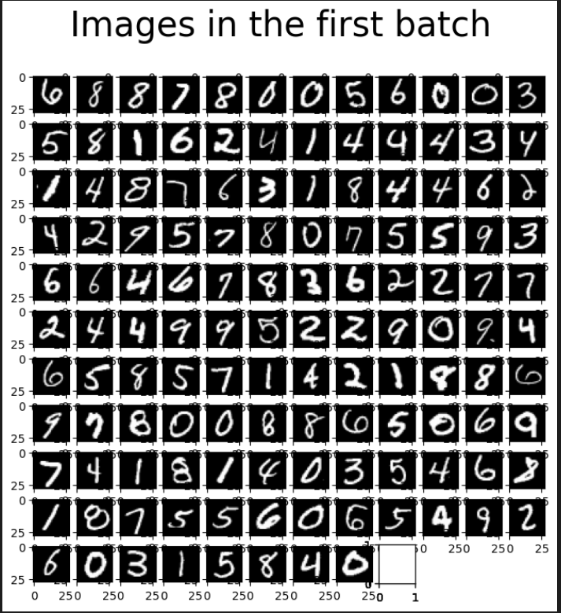

# 模式识别与计算机视觉第三次作业实验2报告
学号:20337011 姓名:陈俊皓

## 实验要求
1. 阅读原始论文和相关参考资料，基于 Pytorch 实现简单版 DDPM（不要求改进），并在**MNIST**和 **Fashion MNIST** 上进行训练，测试生成效果。

2. 在 MNIST 和 Fashion MNIST 上完成 DDPM 的训练，**每个数据集展示 10个生成的图片**，并**以动图形式在 MNIST 和 Fashion MNIST 上各展示一个生成效果图**。

3. 提交源代码和实验报告，对实现过程中的关键步骤进行必要说明


## 实验原理
`DDPM`的基本思想是:给出一个数据集的图像，我们逐步的向其中加入一点点的噪声。在每一步之后，图像会变的越来越模糊，直到剩下全是噪声。该过程被称为前向过程`forward process`。之后，我们学习一个深度模型可以对上述过程进行逆变换，该过程被称为反向过程`backward process`。如果我们成功学习了一个反向过程，我们将拥有一个可以从随机噪声中生成图像的模型。

### 前向过程
在前向过程中，我们对输入的噪声图片的期望以及方差进行改造，并以此作为输出噪声图片的概率获取输出图片。具体的改造公式如下:
$$
    q(\textbf{x}_t|\textbf{x}_{t-1}) :=N(\textbf{x}_t;\sqrt{1-\beta_t}\textbf{x}_{t-1},\beta_t I)
$$

在每一步中，均有不同的参数$\beta$。越高的$\beta$表示加入越大的噪声。在本片论文中，认为$\beta$值的变化应该是光滑的，此处选择$\beta$随迭代轮次的增加线性地从`0.0001`增加到`0.02`。

此处选择高斯分布的原因是因为我们可以近似的将高斯分布的取值概率利用期望和方差表示如下:

$$
    q(\textbf{x}_t|\textbf{x}_{t-1})=\sqrt{1-\beta_t}\textbf{x}_{t-1}+\sqrt{\beta_t}\epsilon
$$

我们可以看到，前向过程实际上符合`马尔科夫链`的特质。但是如果需要逐步的推算每步扩散所生成的图像，消耗的运算成本太大。下面通过推导间隔多步的概率分布，以实现一步到位实现扩散过程:

$$
\begin{aligned}
 q(\textbf{x}_t|\textbf{x}_{t-1})&=\sqrt{1-\beta_t}\textcolor{red}{x_{t-1}}+\sqrt{\beta_t}\epsilon\\
 q(\textbf{x}_t|\textbf{x}_{t-2})&=\sqrt{1-\beta_t}\textcolor{red}{[\sqrt{1-\beta_{t-1}}x_{t-2}+\sqrt{\beta_{t-1}\epsilon}]}+\sqrt{\beta_t}\epsilon
\end{aligned}
$$

如果继续进行该过程，我们会利用以下两个变量可以得到$q(x_t|x_0)的表达式$:
$$
\begin{aligned}
    \alpha_t&:= 1-\beta_t\\
    \bar{\alpha}_t&:=\prod_{s=1}^{t}\alpha_s\\
    q(\textbf{x}_t|\textbf{x}_0)&=N(\textbf{x}_t;\sqrt{\bar{\alpha}_t}\textbf{x}_0,(1-\bar{\alpha}_t)\textbf{I})
\end{aligned}
$$

由上，我们可以一步到位的通过输入图片$x_0$以及噪声参数$\beta_t,t=1,...,n$计算出最终的加噪结果$x_t$。

### 反向过程
以下我们分析反向过程。由于在每一步中，输入与输出均服从正态分布，因此我们仅需要估计出加噪之前图片的期望和方差即可还原为源图片。具体的还原方式如下:

$$
p_\theta(\textbf{x}_{t-1}|\textbf{x}_t)=N(\textbf{x}_{t-1};\mu_\theta(x_t,t),\sigma_t^2\textbf{I})
$$

根据之前前向过程的图像生成公式，我们可以得到最优的期望估计为:
$$
    \frac{1}{\sqrt{\alpha_t}}(x_t-\frac{\beta_t}{\sqrt{1-\bar{\alpha}}_t}\epsilon)
$$

因此，我们可以把预测模型期望的模型规约为预测加入随机值的模型。即将$\mu_\theta$定义如下:

$$
    \mu_\theta(x_t,t)=\frac{1}{\sqrt{\alpha_t}}(x_t--\frac{\beta_t}{\sqrt{1-\bar{\alpha}}_t}\epsilon_\theta(x_t,t))
$$


的到上述方程后，我们即可根据预测输入噪声与实际噪声的`MSE`作为损失更新模型参数:

$$
    E_{x_0,\epsilon}[\frac{\beta_t^2}{2\sigma_t^2\alpha_t(1-\bar{\alpha}_t)}||\epsilon -\epsilon_\theta(\sqrt{\bar{\alpha}_t}x_0+\sqrt{1-\bar{\alpha}_t}\epsilon,t)||^2]
$$

## 实验过程

### 定义超参数与输入输出路径:
```python
# setting reproducbility
SEED = 0
random.seed(SEED)
np.random.seed(SEED)
torch.manual_seed(SEED)


# Definitions
STORE_PATH_MNIST = f'ddpm_model_mnist.pt'
STORE_PATH_FASHION = f'ddpm_model_fashion.pt'

no_train = False
fashion = False # MNIST dataset
batch_size = 128
n_epochs = 20
lr = 0.01

store_path = 'ddpm_fashion.pt' if fashion else 'ddpm_mnist.pt'
```

+ `no_train`表明是否使用预训练模型而跳过训练轮
+ `fashion`表明使用的数据集市`MNIST`还是`Fashion-MNIST`
+ `batch_size`,`n_epochs`和`lr`是训练所需的超参数

### 定义输出生成与还原图像的方法
```python
def show_images(images, title=""):
    """Shows the provided images as sub-pictures in a square"""

    # Converting images to CPU numpy arrays
    if type(images) is torch.Tensor:
        images = images.detach().cpu().numpy()

    # Defining number of rows and columns
    fig = plt.figure(figsize=(8, 8))
    rows = int(len(images) ** (1 / 2))
    cols = round(len(images) / rows)

    # Populating figure with sub-plots
    idx = 0
    for r in range(rows):
        for c in range(cols):
            fig.add_subplot(rows, cols, idx + 1)

            if idx < len(images):
                plt.imshow(images[idx][0], cmap="gray")
                idx += 1
    fig.suptitle(title, fontsize=30)

    # Showing the figure
    plt.show()

def show_first_batch(loader):
    for batch in loader:
        show_images(batch[0], "Images in the first batch")
        break
```

### 下载实验所需的数据集
此处使用`MNIST`以及`FashionMNIST`数据集，测试时目标是让模型可以从随机高斯噪声中产生新的样本。<b>NOTE</b>:此处将图片的范围定为`[-1,1]`而非`[0,1]`。原因是`DDPM`训练过程中加入的随机噪声服从标准正态分布。

```python
# Loading the data
transform =  Compose([
    ToTensor(),
    Lambda(lambda x:(x - 0.5) * 2)
])

ds_fn = FashionMNIST if fashion else MNIST
dataset = ds_fn("./datasets", download=True, train=True, transform=transform)
loader = DataLoader(dataset, batch_size, shuffle=True)
```

输出:
```C
Downloading http://yann.lecun.com/exdb/mnist/train-images-idx3-ubyte.gz
Downloading http://yann.lecun.com/exdb/mnist/train-images-idx3-ubyte.gz to ./datasets/MNIST/raw/train-images-idx3-ubyte.gz
100%|██████████| 9912422/9912422 [00:05<00:00, 1737963.46it/s]
Extracting ./datasets/MNIST/raw/train-images-idx3-ubyte.gz to ./datasets/MNIST/raw

Downloading http://yann.lecun.com/exdb/mnist/train-labels-idx1-ubyte.gz
Downloading http://yann.lecun.com/exdb/mnist/train-labels-idx1-ubyte.gz to ./datasets/MNIST/raw/train-labels-idx1-ubyte.gz
100%|██████████| 28881/28881 [00:00<00:00, 3371529.79it/s]
Extracting ./datasets/MNIST/raw/train-labels-idx1-ubyte.gz to ./datasets/MNIST/raw

Downloading http://yann.lecun.com/exdb/mnist/t10k-images-idx3-ubyte.gz
Downloading http://yann.lecun.com/exdb/mnist/t10k-images-idx3-ubyte.gz to ./datasets/MNIST/raw/t10k-images-idx3-ubyte.gz
100%|██████████| 1648877/1648877 [00:00<00:00, 2938442.32it/s]
Extracting ./datasets/MNIST/raw/t10k-images-idx3-ubyte.gz to ./datasets/MNIST/raw

Downloading http://yann.lecun.com/exdb/mnist/t10k-labels-idx1-ubyte.gz
Downloading http://yann.lecun.com/exdb/mnist/t10k-labels-idx1-ubyte.gz to ./datasets/MNIST/raw/t10k-labels-idx1-ubyte.gz
100%|██████████| 4542/4542 [00:00<00:00, 10393087.16it/s]

Extracting ./datasets/MNIST/raw/t10k-labels-idx1-ubyte.gz to ./datasets/MNIST/raw
```

下载数据可视化:


### 设备设置与检查
```python
# Getting device
device = torch.device("cuda" if torch.cuda.is_available() else "cpu")
print(f"Using device: {device}\t" + (f"{torch.cuda.get_device_name(0)}" if torch.cuda.is_available() else "CPU") )
```

输出:
```C
Using device: cuda	NVIDIA TITAN Xp
```

### 定义DDPM模型
现在可以开始定义DDPM模型，我们使用如下参数:
+ `n_steps`:扩散步数$T$.
+ `min_beta`:$\beta_t$中的最小值(此处为$\beta_1$).
+ `max_beta`:$\beta_t$中的最大值(此处为$\beta_t$).
+ `device`:gpu
+ `image_chw`:存储输入图像的维度

#### `forward` process
在前向过程中，我们可以利用原论文的推导，利用参数$\alpha_b a r$只进行一次扩散便得到最终的结果。

#### `backward` process
在反向过程中，我们则让模型逐步的实现去噪的功能。

```python
# DDPM class
class MyDDPM(nn.Module):
    def __init__(self, network, n_steps=200, min_beta=10** -4, max_beta=0.02, device=None,
                 images_chw=(1,28,28)):
        super(MyDDPM, self).__init__()
        self.n_steps = n_steps
        self.device = device
        self.image_chw = images_chw
        self.network = network.to(device)
        # 线性增加beta
        self.betas = torch.linspace(min_beta, max_beta, n_steps).to(device) 
        self.alphas = 1 - self.betas
        self.alpha_bars=torch.tensor([torch.prod(self.alphas[:i+1]) for i in range(len(self.alphas))]).to(device)
    
    def forward(self, x0, t, eta=None):
        # Make input image more noisy
        n, c, h, w = x0.shape
        a_bar=self.alpha_bars[t]
        
        if eta is None:
            eta = torch.randn(n, c, h, w).to(self.device)
        
        noisy = a_bar.sqrt().reshape(n, 1, 1, 1) * x0 + (1 - a_bar).sqrt().reshape(n, 1, 1 ,1) * eta
        return noisy
    
    def backward(self, x, t):
        # Run each image through the network for each timestep t in the vector t.
        # The network returns its estimation of the noise that was added.
        return self.network(x, t)
```

#### 前向过程以及反向过程定义
```python
def show_forward(ddpm, loader, device):
    # Showing the forward porcess
    for batch in loader:
        imgs = batch[0]
        
        show_images(imgs,"Orignial images")
        
        for percent in [0.25, 0.5, 0.75, 1]:
            show_images(
                ddpm(imgs.to(device),
                     [int(percent * ddpm.n_steps) - 1 for _ in range(len(imgs))]),
                f"DDPM Noisy images {int(percent * 100)}%"
            )
            
        break

def generate_new_images(ddpm, n_samples=16, device=None, frames_per_gif=100,gif_name="sampling.gif", c=1, h=28, w=28):
    """Given a DDPM model, a number of samples to be generated and a device, returns some newly generated samples"""
    frame_idxs = np.linspace(0, ddpm.n_steps, frames_per_gif).astype(np.uint)
    frames = []

    with torch.no_grad():
        if device is None:
            device = ddpm.device

        # Starting from random noise
        x = torch.randn(n_samples, c, h, w).to(device)

        for idx, t in enumerate(list(range(ddpm.n_steps))[::-1]):
            # Estimating noise to be removed
            time_tensor = (torch.ones(n_samples, 1) * t).to(device).long()
            eta_theta = ddpm.backward(x, time_tensor)

            alpha_t = ddpm.alphas[t]
            alpha_t_bar = ddpm.alpha_bars[t]

            # Partially denoising the image
            x = (1 / alpha_t.sqrt()) * (x - (1 - alpha_t) / (1 - alpha_t_bar).sqrt() * eta_theta)

            if t > 0:
                z = torch.randn(n_samples, c, h, w).to(device)

                # Option 1: sigma_t squared = beta_t
                beta_t = ddpm.betas[t]
                sigma_t = beta_t.sqrt()

                # Option 2: sigma_t squared = beta_tilda_t
                # prev_alpha_t_bar = ddpm.alpha_bars[t-1] if t > 0 else ddpm.alphas[0]
                # beta_tilda_t = ((1 - prev_alpha_t_bar)/(1 - alpha_t_bar)) * beta_t
                # sigma_t = beta_tilda_t.sqrt()

                # Adding some more noise like in Langevin Dynamics fashion
                x = x + sigma_t * z

            # Adding frames to the GIF
            if idx in frame_idxs or t == 0:
                # Putting digits in range [0, 255]
                normalized = x.clone()
                for i in range(len(normalized)):
                    normalized[i] -= torch.min(normalized[i])
                    normalized[i] *= 255 / torch.max(normalized[i])

                # Reshaping batch (n, c, h, w) to be a (as much as it gets) square frame
                frame = einops.rearrange(normalized, "(b1 b2) c h w -> (b1 h) (b2 w) c", b1=int(n_samples ** 0.5))
                frame = frame.cpu().numpy().astype(np.uint8)

                # Rendering frame
                frames.append(frame)

    # Storing the gif
    with imageio.get_writer(gif_name, mode="I") as writer:
        for idx, frame in enumerate(frames):
            writer.append_data(frame)
            if idx == len(frames) - 1:
                for _ in range(frames_per_gif // 3):
                    writer.append_data(frames[-1])
    return x
```

#### `UNet`网络定义
我们此处定义用于去噪的模型，根据原论文，我们选用`UNet`模型。模型的优化目标为 $||\epsilon-\epsilon_\theta(\sqrt{\bar{\alpha}_t}x_0+\sqrt{1-\bar{\alpha}_t}\epsilon,t)||^2$ ,此处的 $\epsilon$ 是随机产生的参数,$\epsilon_\theta$ 是模型预估的噪声大小。值得注意的是，在所有的时间步中，去噪模型共享同一套参数。因此，为了区分不同的时间步，此处利用`sinusoidal embedding`的方式，将时间步作为参数输入到模型之中。

```python
def sinusoidal_embedding(n,d):
    # Return the standard positional embedding
    embedding = torch.zeros(n,d)
    wk = torch.tensor([1 / 10_000 ** (2 * j /d) for j in range(d)])
    wk = wk.reshape((1,d))
    t = torch.arange(n).reshape((n,1))
    embedding[:,::2] = torch.sin(t * wk[:,::2])
    embedding[:,1::2] = torch.cos(t * wk[:,::2])
    
    return embedding
```

#### 实例化模型
```python
# Defining model
n_steps, min_beta, max_beta = 1000, 10 ** -4, 0.02  # Originally used by the authors
ddpm = MyDDPM(MyUNet(n_steps), n_steps=n_steps, min_beta=min_beta, max_beta=max_beta, device=device)

sum([p.numel() for p in ddpm.parameters()])
```

输出:
```C
606852
```

### 训练过程函数
```python
def training_loop(ddpm, loader, n_epochs, optim, device, display=False,
                 store_path="ddpm_model.pt"):
    mse = nn.MSELoss()
    best_loss = float("inf")
    n_steps = ddpm.n_steps
    
    for epoch in tqdm(range(n_epochs), desc=f"Training progress", colour="#00f00"):
        epoch_loss = 0.0
        for step, batch in enumerate(tqdm(loader, leave=False, desc=f"Epoch {epoch + 1}/{n_epochs}", colour="#005500")):
            # loading data
            x0 = batch[0].to(device)
            n = len(x0)
            
            # Picking some noise for each of the images in the batch,  atimestep and the respective aplha_bars
            eta = torch.randn_like(x0).to(device)
            t = torch.randint(0, n_steps, (n,)).to(device)
            
            # Computing the noisy image based on x0 and the time-step (forward process)
            noisy_imgs = ddpm(x0, t, eta)
            
            # Getting model estimation of noise based on the image and the time-step
            eta_theta = ddpm.backward(noisy_imgs, t.reshape(n,-1))
            
            # Optimizing the MSE between the noise plugged and the predicted noise
            loss =mse(eta_theta, eta)
            optim.zero_grad()
            loss.backward()
            optim.step()
            
            epoch_loss +=loss.item() * len(x0) / len(loader.dataset)
        
        # Display images generated at this epoch
        if display:
            show_images(generate_new_images(ddpm, device=device), f"Images generated at epoch {epoch + 1}")

        log_string = f"Loss at epoch {epoch + 1}: {epoch_loss:.3f}"

        # Storing the model
        if best_loss > epoch_loss:
            best_loss = epoch_loss
            torch.save(ddpm.state_dict(), store_path)
            log_string += " --> Best model ever (stored)"

        print(log_string)

# Training
store_path = "ddpm_fashion.pt" if fashion else "ddpm_mnist.pt"
if not no_train:
    training_loop(ddpm, loader, n_epochs, optim=Adam(ddpm.parameters(), lr), device=device, store_path=store_path)
```

输出:
```C
/data3/cjh/anaconda3/envs/pytorch_cjh_39/lib/python3.9/site-packages/tqdm/std.py:163: TqdmWarning: Unknown colour (#00f00); valid choices: [hex (#00ff00), BLACK, RED, GREEN, YELLOW, BLUE, MAGENTA, CYAN, WHITE]
  self.colour = colour
Training progress:   5%|▌         | 1/20 [00:25<08:04, 25.48s/it]Loss at epoch 1: 0.114 --> Best model ever (stored)
Training progress:  10%|█         | 2/20 [00:50<07:35, 25.33s/it]Loss at epoch 2: 0.048 --> Best model ever (stored)
Training progress:  15%|█▌        | 3/20 [01:15<07:09, 25.28s/it]Loss at epoch 3: 0.041 --> Best model ever (stored)
...
Training progress:  90%|█████████ | 18/20 [07:14<00:46, 23.48s/it]Loss at epoch 18: 0.034
Training progress:  95%|█████████▌| 19/20 [07:37<00:23, 23.39s/it]Loss at epoch 19: 0.033 --> Best model ever (stored)
Training progress: 100%|██████████| 20/20 [08:01<00:00, 24.05s/it]Loss at epoch 20: 0.033 --> Best model ever (stored)
```

### 测试训练模型
```python
# Loading the trained model
best_model = MyDDPM(MyUNet(n_steps), n_steps=n_steps, device=device)
best_model.load_state_dict(torch.load(store_path, map_location=device))
best_model.eval()
print("Model loaded")

print("Generating new images")
generated = generate_new_images(
        best_model,
        n_samples=100,
        device=device,
        gif_name="fashion.gif" if fashion else "mnist.gif"
    )
show_images(generated, "Final result")
```
## 实验结果

### `MNIST`生成的图片


### `FashionMNIST`生成的图片


## 实验心得

通过此次实验，我学习到了`DDPM`模型的算法原理以及实现方法。


