# 模式识别与计算机视觉第三次作业实验1报告
学号:20337011 姓名:陈俊皓

## 实验要求
1. 阅读原始论文和相关参考资料，基于 Pytorch 实现 MixMatch 和 FixMatch 半
监督图像分类算法，按照原始论文的设置，MixMatch 和 FixMatch 均使用
WideResNet-28-2 作为 Backbone 网络，即深度为 28，扩展因子为 2， 在
CIFAR-10 数据集上进行半监督图像分类实验，<b>报告算法在分别使用 40, 250, 4000 张标注数据的情况下的图像分类效果（标注数据随机选取指定数量）。</b>

2. 使用 TorchSSL 中提供的 MixMatch 和 FixMatch 的实现进行半监督训练和测
试，<b>对比自己实现的算法和 TorchSSL 中的实现的效果。</b>

3. 提交源代码，并提交实验报告，描述主要的实现步骤，并<b>分析对比 MixMatch
和 FixMatch 的相同点和不同点。</b>


## 实验原理

### `MixMatch`算法阐述


`MixMatch`算法主要应用了以下三个应用半监督学习的方法:

1. <b>自洽正则化(Consistency Regularization)</b>。由于半监督学习中，由于标记数据太少，因此模型很容出现过拟合。为了增强模型的泛化能力，人们一般进行训练数据增广(随机平移，缩放，旋转，扭曲，剪切，改变亮度，饱和度，加噪声等)。自洽正则化的思路是，对未标记数据进行数据增广，产生的新数据输入分类器，预测结果应该自洽。即同一个数据增广产生的样本，模型预测结果应保持一致。我们可以表示改规则如下:
$$
||P_{model}(y|Augument(x);\theta) - P_{model}(y|Augument(x);\theta)||_2^2
$$

其中$x$是未标记数据，$Augument(x)$表示对$x$做随机增广产生的新数据，$ \theta $是模型参数，$y$是模型的预测结果。

2. <b>最小化熵</b>.许多半监督学习都给予一个共识，即分类器的分类边界不应该穿过编辑分布的高密度区域。具体做法就是强迫分类器对未标记数据做出低熵预测。实现方法是引入温度$T,从而最小化$P_model(y|x)$对应的熵。

3. <b>传统正则化</b>。为了让模型泛化能力更好，会对模型参数做L2正则化，SGD下L2正则化等价于weight decay。

4. <b>Mixup 数据增广</b>.从训练数据中任一抽取两个样本，构建混合样本和缓和标签，作为新的增广数据，

$$
\begin{aligned}
\widetilde{x}&= \lambda x_i + (1 - \lambda)x_j,\;\; where\;x_i,x_j\;are\;raw\;input\;vectors\\
\widetilde{y}&= \lambda y_i + (1- \lambda)y_j,\;\;where\;x_i,x_j\;are\;one-hot\;label\;encodings
\end{aligned}
$$

其中$\lambda$是一个$[0,1]$之间的证书，代表两个样本的混合比例。

#### `MixMatch`方案
首先，对一个`batch`的标记图片和未标记图片做数据增广。对标记图片，只做一次增广，标签不变，即为$p$。队尾标记数据，做`K`次随机增广没输入分类器，的到平均分类概率，应用温度`Sharpen`算法，得到未标记数据的"猜测"标签$q$。此时增广后的标记数据$\^{X}$有一个`batch`,增广后的未标记数据$\^{U}$有`k`个`batch`。将$\^{X}$和$\^{U}$混合在一起，随机重排得到数据集$W$。最终`MixMatch`增广算法输出的，是将$\^{X}$与$W
做了`MixUp(`的一个batch的标记数据$X'$，以及$\^{U}$与$W$做了`MixUp()`的`k`个`batch`的无标记增广数据$U'$。

对争光后的标记数据$X'$，和无标记数据$U'$分别计算损失项，

$$
\begin{aligned}
L_X&=\frac{1}{|X'|}\sum_{x,p\in X'}H(p,P_{model}(y|x;\theta))\\
L_U&=\frac{1}{L|U'|}\sum_{u,q\in U'}||q-P_{model}(y|u;\theta)||_2^2
\end{aligned}
$$

最终的整体损失函数是两者的加权:
$$
L=L_X + \lambda_U L_U
$$

原文中使用`Sharpen`函数降低"伪"标签的熵。其具体的函数形式如下:
$$
Sharpen(p,T)=p_i^{\frac{1}{T}}/\sum_{j=1}^L p_j^{\frac{1}{T}}
$$

此外，`MixMatch`修改了`MixUp`算法。对于加权参数的选择，利用了`Beta`函数如下:
$$
\begin{aligned}
x'&=\lambda 'x_1+(1-\lambda ')x_2\\
p'&=\lambda 'p_1+(1-\lambda ')p_2
\end{aligned}
$$

其中:
$$
\begin{aligned}
\lambda&\sim Beta(\alpha,\alpha)\\
\lambda '&=max(\lambda,1-\lambda)
\end{aligned}
$$

### `FixMatch`算法阐述
`FixMatch`首先将训练过程两个部分，有监督训练和无监督训练。有`label`的数据，执行有监督训练，和普通分类任务训练没有区别。没有`label`的数据，首先经过弱增强获取伪标签。然后利用该伪标签去监督强增强的输出值，只有大于一定预置条件才执行伪标签的生成。

此处引用"hard"标签，也就是`argmax`获取的one-hot标签，仅保留最大类概率超过阈值的标签。计算loss时如下:
$$
\frac{1}{\mu B}\sum_{b=1}^{\mu B}1(max(q_b)\geq t)H(\^{q_b},q_b)
$$

无监督训练过程实际上是一个孪生网络，可以提取到图片的有用特征。弱增强不至于图像失真，再加上输出伪标签阈值的设置，极大程度上降低了引入错误标签噪声的可能性。而仅仅使用弱增强可能会导致训练过拟合，无法提取到本质的特征，所以使用强增强。强增强带来图片的严重失真，但是依然是保留足够可以辨认类别的特征。有监督和无监督混合训练，逐步提高模型的表达能力。


整体的算法过程如下:
1. 输入的数据包括两个部分，有标注的数据和没有标注的数据且设定置信度阈值，采样比例等超参数。
2. 对有标注的部分执行有监督训练，使用传统的CE loss。
3. 遍历无标注的数据，利用弱增强获取伪标签。
4. 对无标注的数据， 利用获取的伪标签进行训练，通用利用CE loss。
5. 根据一定的loss权重融合二者的loss

#### loss 计算
loss包括两部分，标注有监督分类任务loss和无监督伪标签训练loss分别如下:
$$
\begin{aligned}
    l_s&= \frac{1}{B}\sum_{b=1}{B} H(p_b,p_m(y|\alpha(x_b)))\\
    l_u&=\frac{1}{\mu B}\sum_{b=1}^{\mu B}1(max(q_b)\geq t)H(\^{q_b},p_m(y|\Alpha(u_b)))
\end{aligned}
$$

其中$\alpha(\cdot)$博鳌是弱增强，一般为flip、平移；$\Alpha(\cdot)$表示强增强，一般为色彩变换、对比度增强，旋转等。

## 实验过程

### 图片增广预处理
由于`FixMatch`中引入了强弱数据增强的概念，较`MixMatch`的数据增广更为复杂。因此此处阐述`FixMatch`的数据增广过程。

首先介绍数据增广所涉及的变换类型:
```python
def my_augment_pool():
    # Test
    augs = [(AutoContrast, None, None),
            (Brightness, 1.8, 0.1),
            (Color, 1.8, 0.1),
            (Contrast, 1.8, 0.1),
            (Cutout, 0.2, 0),
            (Equalize, None, None),
            (Invert, None, None),
            (Posterize, 4, 4),
            (Rotate, 30, 0),
            (Sharpness, 1.8, 0.1),
            (ShearX, 0.3, 0),
            (ShearY, 0.3, 0),
            (Solarize, 256, 0),
            (SolarizeAdd, 110, 0),
            (TranslateX, 0.45, 0),
            (TranslateY, 0.45, 0)]
    return augs
```
对于弱增强，设置阈值为`0.8`，即只有随机产生数值大于`0.8`才会发生对应的图像增广。具体实现的代码如下:
```python
class RandAugmentPC(object):
    def __init__(self, n, m):
        assert n >= 1
        assert 1 <= m <= 10
        self.n = n
        self.m = m
        self.augment_pool = my_augment_pool()

    def __call__(self, img):
        ops = random.choices(self.augment_pool, k=self.n)
        for op, max_v, bias in ops:
            prob = np.random.uniform(0.2, 0.8)
            if random.random() + prob >= 1:
                img = op(img, v=self.m, max_v=max_v, bias=bias)
        img = CutoutAbs(img, int(32*0.5))
        return img
```

对于强增强，设置阈值为`0.5`，具体的实现代码如下:
```python
class RandAugmentMC(object):
    def __init__(self, n, m):
        assert n >= 1
        assert 1 <= m <= 10
        self.n = n
        self.m = m
        self.augment_pool = fixmatch_augment_pool()

    def __call__(self, img):
        ops = random.choices(self.augment_pool, k=self.n)
        for op, max_v, bias in ops:
            v = np.random.randint(1, self.m)
            if random.random() < 0.5:
                img = op(img, v=v, max_v=max_v, bias=bias)
        img = CutoutAbs(img, int(32*0.5))
        return img
```

### 数据集调用
在此次实验中，选用了`cifar10`数据集，利用`torchvision`库可以完成相应数据的下载和`dataloader`定义。值得注意的是，此处由于应用于半监督分类任务，因此需要将源数据集中的数据随机划分为两部分，一部分为有标签数据，另一部分为无标签数据。另一方面，我们需要令有标签数据覆盖每一个类，在`cifar10`数据集中，则需要限定最小的标签数据个数为`10`。具体实现过程如下:
```python
def x_u_split(args, labels):
    label_per_class = args.num_labeled // args.num_classes
    labels = np.array(labels)
    labeled_idx = []
    
    unlabeled_idx = np.array(range(len(labels)))
    for i in range(args.num_classes):
        idx = np.where(labels == i)[0]
        idx = np.random.choice(idx, label_per_class, False)
        labeled_idx.extend(idx)
    labeled_idx = np.array(labeled_idx)
    assert len(labeled_idx) == args.num_labeled

    if args.expand_labels or args.num_labeled < args.batch_size:
        num_expand_x = math.ceil(
            args.batch_size * args.eval_step / args.num_labeled)
        labeled_idx = np.hstack([labeled_idx for _ in range(num_expand_x)])
    np.random.shuffle(labeled_idx)
    return labeled_idx, unlabeled_idx
```

完成数据划分之后，我们需要对数据进行增广操作。可以看到，数据增广在`FixMatch`算法中仅仅针对无标签数据进行。利用先前定义的数据增广算法，我们可以定义类`TransformFixMatch`，并实现其调用方法:
```python
class TransformFixMatch(object):
    def __init__(self, mean, std):
        self.weak = transforms.Compose([
            transforms.RandomHorizontalFlip(),
            transforms.RandomCrop(size=32,
                                  padding=int(32*0.125),
                                  padding_mode='reflect')])
        self.strong = transforms.Compose([
            transforms.RandomHorizontalFlip(),
            transforms.RandomCrop(size=32,
                                  padding=int(32*0.125),
                                  padding_mode='reflect'),
            RandAugmentMC(n=2, m=10)])
        self.normalize = transforms.Compose([
            transforms.ToTensor(),
            transforms.Normalize(mean=mean, std=std)])

    def __call__(self, x):
        weak = self.weak(x)
        strong = self.strong(x)
        return self.normalize(weak), self.normalize(strong)
```

接下来，我们需要定义分发`batch`完成训练与测试的类`CIFAR10SL`。该类继承`dataset.CIFAR10`,具体需要实现`__getitem__`方法。

```python
class CIFAR10SSL(datasets.CIFAR10):
    def __init__(self, root, indexs, train=True,
                 transform=None, target_transform=None,
                 download=False):
        super().__init__(root, train=train,
                         transform=transform,
                         target_transform=target_transform,
                         download=download)
        if indexs is not None:
            self.data = self.data[indexs]
            self.targets = np.array(self.targets)[indexs]

    def __getitem__(self, index):
        img, target = self.data[index], self.targets[index]
        img = Image.fromarray(img)

        if self.transform is not None:
            img = self.transform(img)

        if self.target_transform is not None:
            target = self.target_transform(target)

        return img, target
```

完成每个`batch`的训练与测试过程实现之后，我们可以完成有监督训练集，无监督训练集以及测试集组装函数。

```python
def get_cifar10(args, root):
    transform_labeled = transforms.Compose([
        transforms.RandomHorizontalFlip(),
        transforms.RandomCrop(size=32,
                              padding=int(32*0.125),
                              padding_mode='reflect'),
        transforms.ToTensor(),
        transforms.Normalize(mean=cifar10_mean, std=cifar10_std)
    ])
    transform_val = transforms.Compose([
        transforms.ToTensor(),
        transforms.Normalize(mean=cifar10_mean, std=cifar10_std)
    ])
    base_dataset = datasets.CIFAR10(root, train=True, download=True)

    train_labeled_idxs, train_unlabeled_idxs = x_u_split(
        args, base_dataset.targets)

    train_labeled_dataset = CIFAR10SSL(
        root, train_labeled_idxs, train=True,
        transform=transform_labeled)

    train_unlabeled_dataset = CIFAR10SSL(
        root, train_unlabeled_idxs, train=True,
        transform=TransformFixMatch(mean=cifar10_mean, std=cifar10_std))

    test_dataset = datasets.CIFAR10(
        root, train=False, transform=transform_val, download=False)

    return train_labeled_dataset, train_unlabeled_dataset, test_dataset
```


### 模型定义

在此次实验中，我们选用`WideResNet-28-2`作为`backbone`,其含义是网络深度为28，扩展因子为2。具体的定义方法如下。

```python
class WideResNet(nn.Module):
    def __init__(self, num_classes, depth=28, widen_factor=2, drop_rate=0.0):
        super(WideResNet, self).__init__()
        channels = [16, 16*widen_factor, 32*widen_factor, 64*widen_factor]
        assert((depth - 4) % 6 == 0)
        n = (depth - 4) / 6
        block = BasicBlock
        # 1st conv before any network block
        self.conv1 = nn.Conv2d(3, channels[0], kernel_size=3, stride=1,
                               padding=1, bias=False)
        # 1st block
        self.block1 = NetworkBlock(
            n, channels[0], channels[1], block, 1, drop_rate, activate_before_residual=True)
        # 2nd block
        self.block2 = NetworkBlock(
            n, channels[1], channels[2], block, 2, drop_rate)
        # 3rd block
        self.block3 = NetworkBlock(
            n, channels[2], channels[3], block, 2, drop_rate)
        # global average pooling and classifier
        self.bn1 = nn.BatchNorm2d(channels[3], momentum=0.001)
        self.relu = nn.LeakyReLU(negative_slope=0.1, inplace=True)
        self.fc = nn.Linear(channels[3], num_classes)
        self.channels = channels[3]

        for m in self.modules():
            if isinstance(m, nn.Conv2d):
                nn.init.kaiming_normal_(m.weight,
                                        mode='fan_out',
                                        nonlinearity='leaky_relu')
            elif isinstance(m, nn.BatchNorm2d):
                nn.init.constant_(m.weight, 1.0)
                nn.init.constant_(m.bias, 0.0)
            elif isinstance(m, nn.Linear):
                nn.init.xavier_normal_(m.weight)
                nn.init.constant_(m.bias, 0.0)

    def forward(self, x):
        out = self.conv1(x)
        out = self.block1(out)
        out = self.block2(out)
        out = self.block3(out)
        out = self.relu(self.bn1(out))
        out = F.adaptive_avg_pool2d(out, 1)
        out = out.view(-1, self.channels)
        return self.fc(out)
```
### 训练过程

完成了模型定义与数据集预处理，我们可以定义训练模型以及测试有效性的过程。

#### `MixMatch` 训练与测试过程

`MixMatch`的训练过程涉及对有标签数据与无标签数据的`Mixup`操作。在训练的过程中，专注与议论迭代的训练过程(即一个`batch`)。根据原论文，我们可以知道:对于有标签数据，仅需要得到源输入数据以及相应的标签；对于无标签数据，则需要得到扩展后的输入数据，此处的扩展因子为`2`。具体实现过程如下:

```python
    labeled_train_iter = iter(labeled_trainloader)
    unlabeled_train_iter = iter(unlabeled_trainloader)

    model.train()
    for batch_idx in range(args.train_iteration):
        try:
            inputs_x, targets_x = labeled_train_iter.next()
        except:
            labeled_train_iter = iter(labeled_trainloader)
            inputs_x, targets_x = labeled_train_iter.next()

        try:
            (inputs_u, inputs_u2), _ = unlabeled_train_iter.next()
        except:
            unlabeled_train_iter = iter(unlabeled_trainloader)
            (inputs_u, inputs_u2), _ = unlabeled_train_iter.next()
```

在`MixMatch`中，对于有标签数据，则将其分类概率向量转化为`one-hot`的形式；对于无标签数据，则使用其模型预测的结果，软后计算其均值(此处为利用之前所提到的`自洽正则化`)，最后使用`sharpen`函数进行低熵化处理，以最后计算的结果作为后续`Mixup`的依据。该步操作的代码实现如下:

```python
batch_size = inputs_x.size(0)

        # Transform label to one-hot
        targets_x = torch.zeros(batch_size, 10).scatter_(1, targets_x.view(-1,1).long(), 1)

        if use_cuda:
            inputs_x, targets_x = inputs_x.cuda(), targets_x.cuda(non_blocking=True)
            inputs_u = inputs_u.cuda()
            inputs_u2 = inputs_u2.cuda()


        with torch.no_grad():
            # compute guessed labels of unlabel samples
            outputs_u = model(inputs_u)
            outputs_u2 = model(inputs_u2)
            p = (torch.softmax(outputs_u, dim=1) + torch.softmax(outputs_u2, dim=1)) / 2
            pt = p**(1/args.T)
            targets_u = pt / pt.sum(dim=1, keepdim=True)
            targets_u = targets_u.detach()

```

完成有标签数据以及无标签数据的分类预测之后，我们即可进行`MixUp`操作并计算最后的`loss`。
```python
        # mixup
        all_inputs = torch.cat([inputs_x, inputs_u, inputs_u2], dim=0)
        all_targets = torch.cat([targets_x, targets_u, targets_u], dim=0)

        l = np.random.beta(args.alpha, args.alpha)

        l = max(l, 1-l)

        idx = torch.randperm(all_inputs.size(0))

        input_a, input_b = all_inputs, all_inputs[idx]
        target_a, target_b = all_targets, all_targets[idx]

        mixed_input = l * input_a + (1 - l) * input_b
        mixed_target = l * target_a + (1 - l) * target_b

        # interleave labeled and unlabed samples between batches to get correct batchnorm calculation 
        mixed_input = list(torch.split(mixed_input, batch_size))
        mixed_input = interleave(mixed_input, batch_size)

        logits = [model(mixed_input[0])]
        for input in mixed_input[1:]:
            logits.append(model(input))

        # put interleaved samples back
        logits = interleave(logits, batch_size)
        logits_x = logits[0]
        logits_u = torch.cat(logits[1:], dim=0)

        Lx, Lu, w = criterion(logits_x, mixed_target[:batch_size], logits_u, mixed_target[batch_size:], epoch+batch_idx/args.train_iteration)

        loss = Lx + w * Lu
```
#### `FixMatch` 训练与测试过程

`FixMatch`算法将有标签数据的训练与无标签数据的训练分离。具体的操作流程如下:
```python
            inputs = interleave(
                torch.cat((inputs_x, inputs_u_w, inputs_u_s)), 2*args.mu+1).to(args.device)
            targets_x = targets_x.to(args.device)
            logits = model(inputs)
            logits = de_interleave(logits, 2*args.mu+1)
            logits_x = logits[:batch_size]
            logits_u_w, logits_u_s = logits[batch_size:].chunk(2)
            del logits

            Lx = F.cross_entropy(logits_x, targets_x, reduction='mean')

            pseudo_label = torch.softmax(logits_u_w.detach()/args.T, dim=-1)
            max_probs, targets_u = torch.max(pseudo_label, dim=-1)
            mask = max_probs.ge(args.threshold).float()

            Lu = (F.cross_entropy(logits_u_s, targets_u,
                                  reduction='none') * mask).mean()

            loss = Lx + args.lambda_u * Lu
```


## 实验结果

### `MixMatch`实验结果
#### `n_labeled = 40`
`log.txt`显示如下:
```C
Train Loss	Train Loss X	Train Loss U	Valid Loss	Valid Acc.	Test Loss	Test Acc.	
1.442079	1.433008	0.010816	2.187725	19.000000	2.179577	18.890000	
1.051468	1.023234	0.012646	2.047040	25.400000	2.032903	26.510000	
0.965738	0.921327	0.011906	1.920079	31.340000	1.901984	32.040000	
0.954995	0.896024	0.011253	1.703301	40.320000	1.683337	41.360000	
0.946157	0.873017	0.010855	1.522691	48.100000	1.506764	48.680000	
0.963819	0.872931	0.011006	1.384015	53.740000	1.371017	54.410000
...
1.491908	0.792729	0.010246	0.938523	73.620000	0.954721	73.340000	
1.523098	0.797593	0.010401	0.929071	73.880000	0.945912	73.420000	
1.465691	0.764598	0.009840	0.931449	74.080000	0.946029	73.480000	
1.552635	0.793708	0.010432	0.911357	74.400000	0.924216	73.660000	
1.544936	0.782904	0.010263	0.909135	74.140000	0.919187	73.580000
```

可视化结果如下:
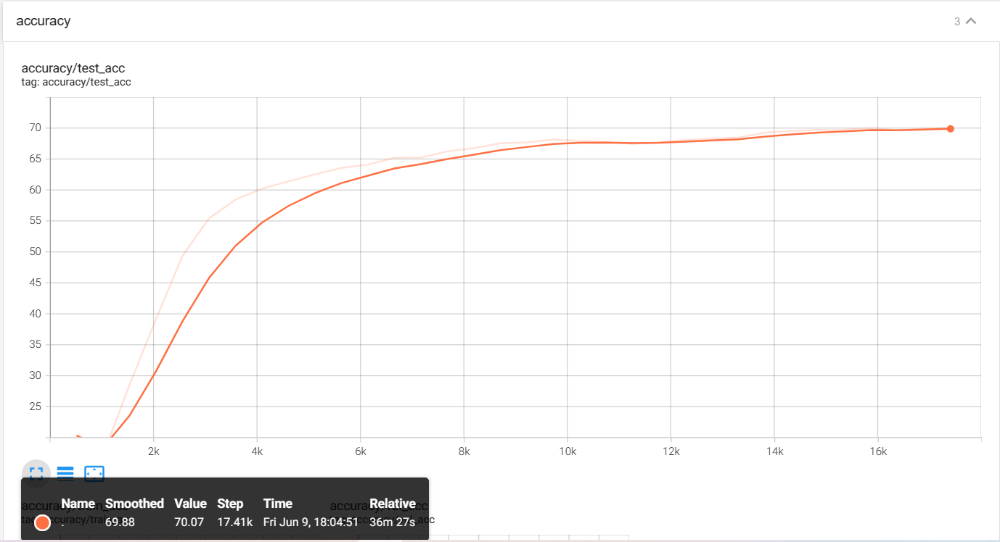
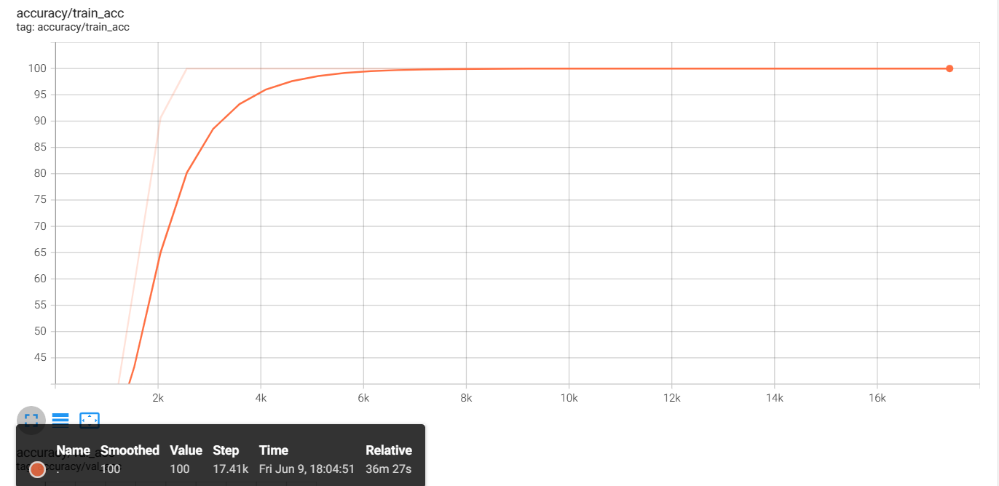
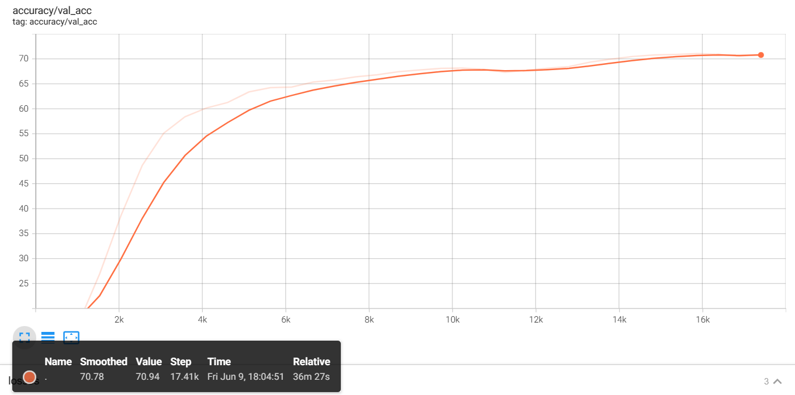

#### `n_labeled = 250`
`log.txt`显示如下:
```C
Train Loss	Train Loss X	Train Loss U	Valid Loss	Valid Acc.	Test Loss	Test Acc.	
1.173956	1.171653	0.011754	2.355381	16.260000	2.350503	16.680000	
0.907337	0.900882	0.011551	1.933748	32.320000	1.917406	32.600000	
0.877526	0.867269	0.010940	1.530550	47.820000	1.515247	48.330000	
0.869699	0.855392	0.010908	1.369051	54.440000	1.357946	54.210000	
0.829455	0.811667	0.010542	1.313829	56.920000	1.302862	56.900000	
0.827620	0.805575	0.010690	1.264044	58.920000	1.257715	58.890000
...
1.289009	0.692361	0.008138	0.533475	86.240000	0.534463	86.180000	
1.310521	0.702963	0.008245	0.524128	86.640000	0.531299	86.270000	
1.335949	0.713295	0.008408	0.536022	86.080000	0.540769	85.980000	
1.301468	0.692266	0.008184	0.535110	86.060000	0.540978	85.890000	
1.308371	0.698027	0.008158	0.537139	85.880000	0.545105	85.890000
```

可视化结果如下:
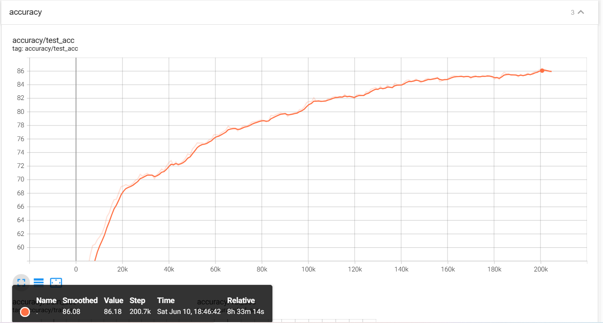
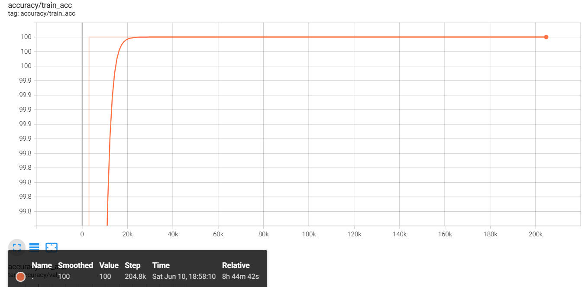
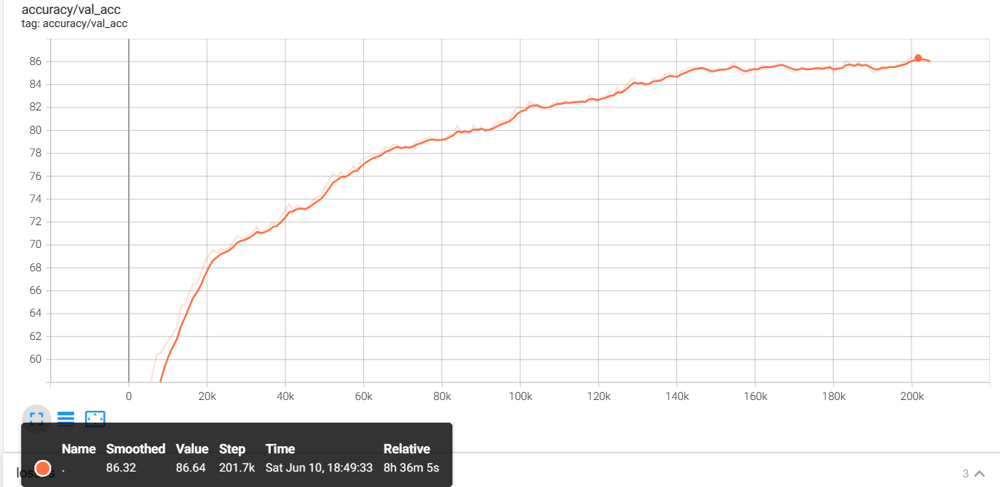
#### `n_labeled = 400`

`log.txt`显示如下:
```C
Train Loss	Train Loss X	Train Loss U	Valid Loss	Valid Acc.	Test Loss	Test Acc.	
1.276674	1.274422	0.011076	2.228191	23.020000	2.214302	23.920000	
0.933617	0.926915	0.011981	1.608579	44.020000	1.577580	45.270000	
0.899530	0.888763	0.011482	1.276097	57.240000	1.246769	58.850000
...
1.278800	0.711252	0.008159	0.456429	88.360000	0.477688	87.920000	
1.265251	0.702829	0.008042	0.463345	88.160000	0.489453	87.460000	
1.322027	0.730761	0.008410	0.469066	87.900000	0.492973	87.450000	
1.323370	0.726310	0.008447	0.474699	88.140000	0.496240	87.230000	
1.295786	0.710555	0.008235	0.483020	87.780000	0.502984	87.050000	
1.321896	0.724083	0.008368	0.482222	87.740000	0.493454	87.220000	
1.319368	0.721692	0.008323	0.479654	87.760000	0.486785	87.230000	
1.348711	0.730599	0.008563	0.483415	87.820000	0.492781	87.250000	
1.319943	0.720318	0.008264	0.480344	87.760000	0.494185	87.310000	
1.316286	0.721116	0.008160	0.485351	87.960000	0.498559	87.270000	
1.322119	0.718315	0.008236	0.480099	87.920000	0.494486	87.290000	
1.350991	0.734006	0.008373	0.479669	87.800000	0.494798	87.320000	
1.331593	0.717350	0.008294	0.467627	88.200000	0.482988	87.730000	
1.361521	0.729208	0.008494	0.475392	88.100000	0.491335	87.500000	
1.352244	0.726216	0.008368	0.468134	88.380000	0.484995	87.590000
```

可视化结果如下:
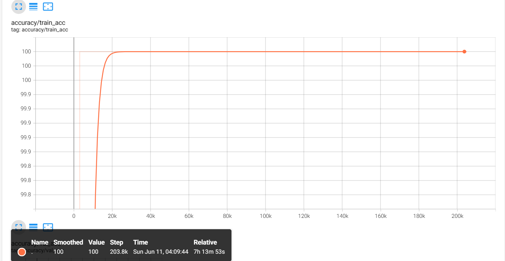
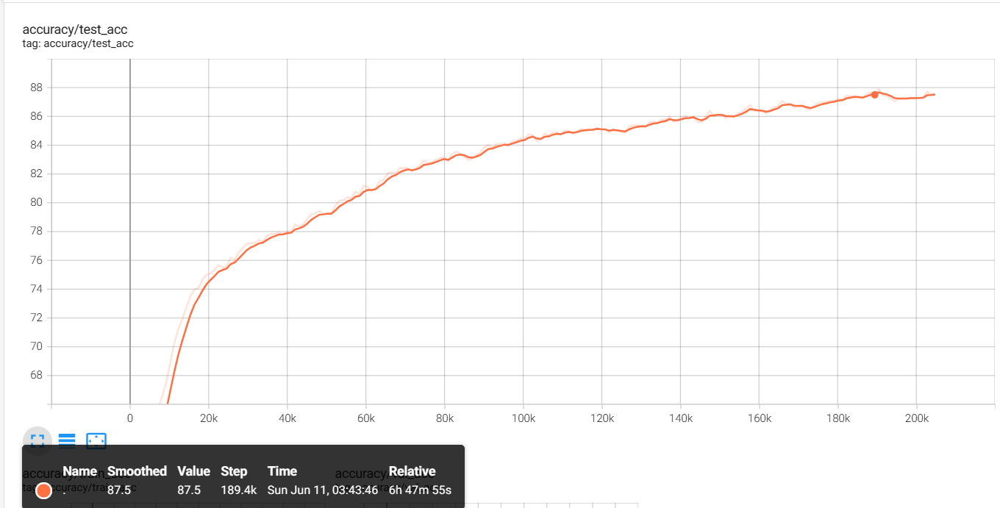
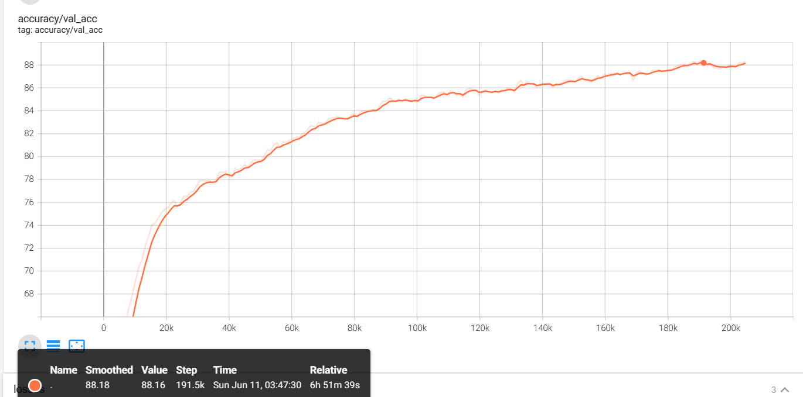

### `FixMatch`实验结果
#### `n_labeled = 40`

可视化结果如下:
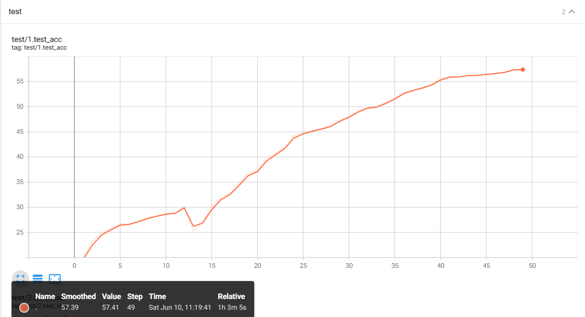
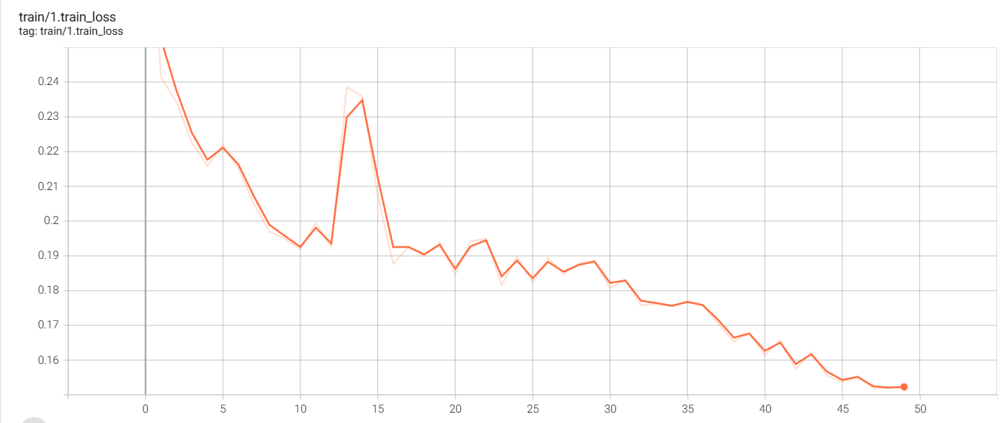

#### `n_labeled = 250`
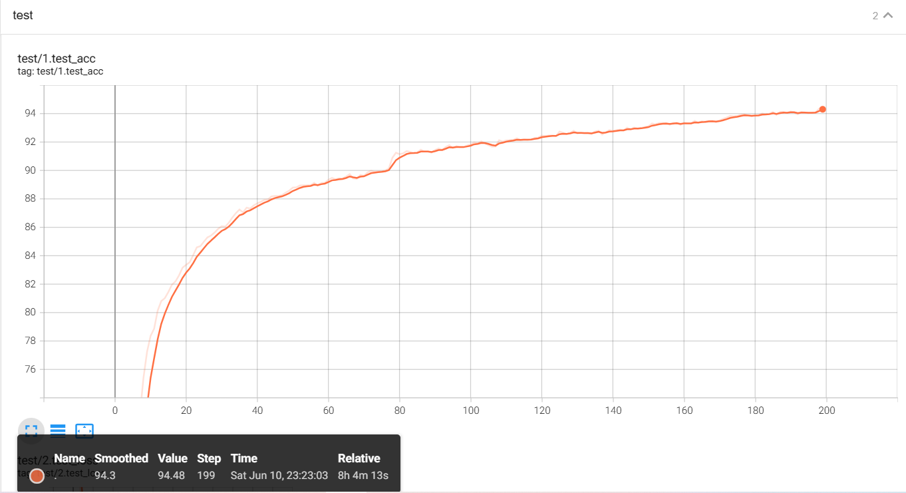


#### `n_labeled = 400`
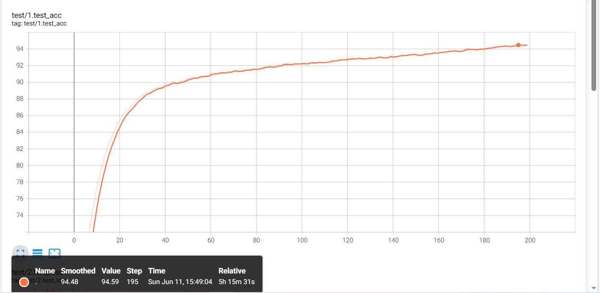
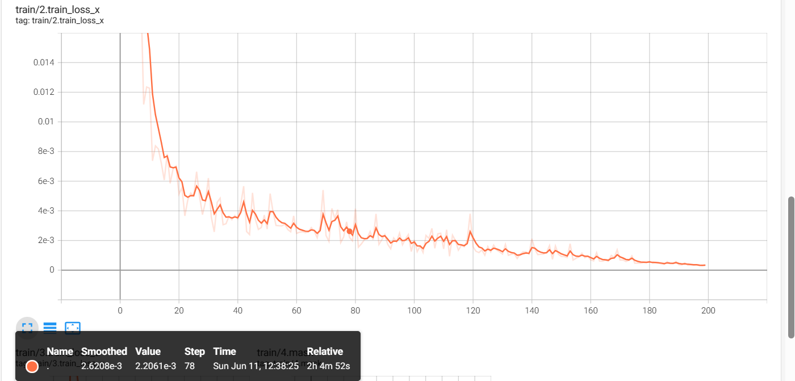

### `TorchSSL`实验结果

|                      |            |  CIFAR-10  |            |
|----------------------|------------|------------|------------|
|                      | 40         | 250        | 1000       |
| MixMatch             | 62.9       | 86.3       | 93.5       | 
| FixMatch             | 92.53      | 95.3       | 95.9       |


## 实验心得

通过此次实验，我了解到半监督分类任务的常用算法以及其实现思路。


